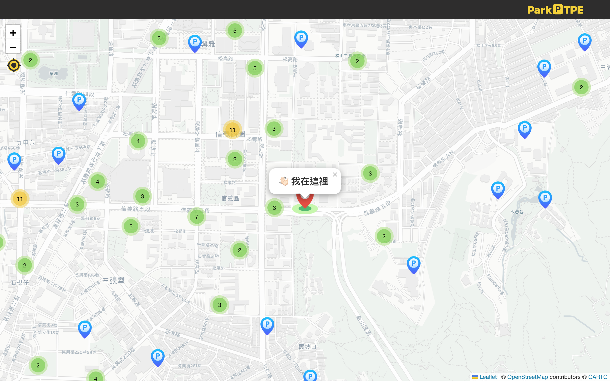
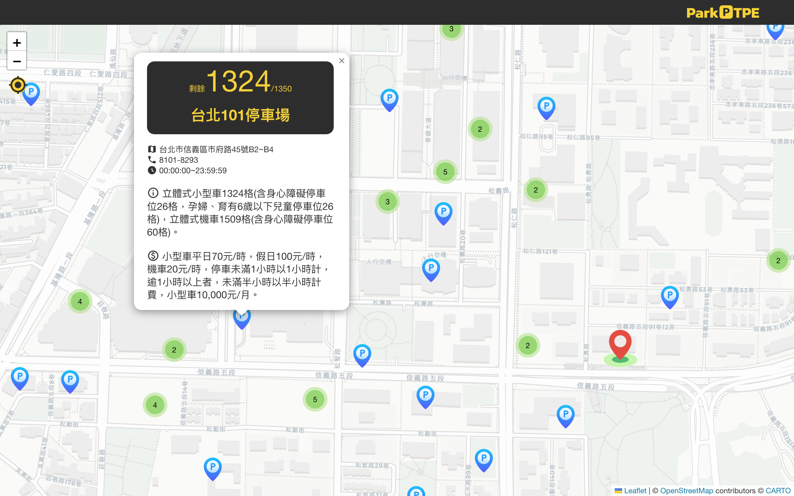

# Park&#x1F17F;TPE

### :red_car: A Comprehensive Taipei Carpark Map for Web and Mobile

The new skills I utilized in this side project include:

- Using a third-party API provided by the government.
- Integrating with third-party map services, OSM (OpenStreetMap).
- Learning GIS application-related skills.
- Utilized Vite instead of CRA for the first time.
- Tried UI library

### :minibus: Tools and packages used in development:

- Vite
- React-Leaflet
- React-Leaflet-Cluster
- Styled-Components
- Material UI

### :taxi: DEMO page [LINK](https://ljbl22.github.io/ParkTPE/)

| desktop                                |
| -------------------------------------- |
|            |
|  |

| mobile                         |                                          | tablet                          |
| ------------------------------ | ---------------------------------------- | ------------------------------- |
|  |  |  |

## :blue_car: Features:

1. Displays nearby parking lots on the map based on the user's GPS location
2. If available through the API, users can view the following information about a parking lot by clicking on it:

- Total and available car spaces
- Address, telephone number, and service hours
- Parking space types and fees\*

3. Allow users to move the map to view parking lots outside of their current location
4. Allow users to update their location after moving by clicking on the locate button
5. Supports desktop, tablet, and mobile devices

## :truck: Installation

Check Node.js installation and version by running the command in the terminal

```
node -v
```

Clone the project to local

```
git clone https://github.com/LJBL22/ParkTPE.git
```

Go to the directory

```
cd ParkTPE
```

Install packages

```
npm install
```

Start the project

```
npm run dev
```

## License

This information is sourced from the [Taipei City Parking Lot Information](https://data.gov.tw/dataset/128435) on the Government Open Data Platform. The original data is licensed under the [Government Open Data License, Version 1](https://data.gov.tw/license), and the source is required to be identified as the [Government Open Data Platform](https://data.gov.tw/) in accordance with the second requirement of the third article.

此資料來源為政府資料開放平台中的臺北市停車場資訊，原始資料使用政府資料開放授權條款-第 1 版授權，依照第三條第二項要求標示出處為政府資料開放平台。

## \*Features in plan

- Due to the complexity of the FareInfo data structure provided by the API, the circle UI for displaying parking fees is currently under development and not yet available on the map.


## \*Notification

At times, the webpage may fail to load, and an error message of "The specified blob does not exist" can be found by inspecting the console. Possible reasons for this issue may include problems with the network connection or a failure in the server response from Azure. Please wait for a moment and try refreshing the page to restore normal functionality.


